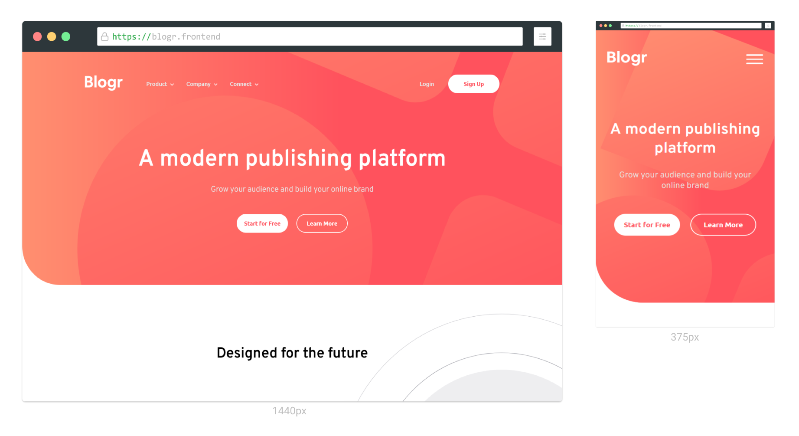

# Frontend Mentor - Blogr landing page solution

This is a solution to the [Blogr landing page challenge on Frontend Mentor](https://www.frontendmentor.io/challenges/blogr-landing-page-EX2RLAApP).
Frontend Mentor challenges help you improve your coding skills by building realistic projects.

## Table of contents

- [Overview](#overview)
  - [The challenge](#the-challenge)
  - [Screenshot](#screenshot)
  - [Links](#links)
- [My process](#my-process)
  - [Built with](#built-with)
  - [What I learned](#what-i-learned)
  - [Useful resources](#useful-resources)
- [Author](#author)

## Overview

### The challenge

Users should be able to:

- View the optimal layout for the site depending on their device's screen size
- See hover states for all interactive elements on the page

### Screenshot

### Links

- Live Site URL: [Blogr landing page](https://t-nabeel.github.io/fem-blogr-landing-page/)

## My process

### Built with

- HTML5 markup
- SASS
- JavaScript
- jQuery
- Mobile-first workflow

### What I learned

By working through this challenge, I learned to use JavaScript to make the site more interactive and how to use jQuery to enable drop down feature in mobile navigation menu.

### Useful resources

- [AOS Library](https://michalsnik.github.io/aos/) - This library helped me to implement animation on scroll feature.

## Author

- Frontend Mentor Profile - [@T-Nabeel](https://www.frontendmentor.io/profile/t-nabeel)
